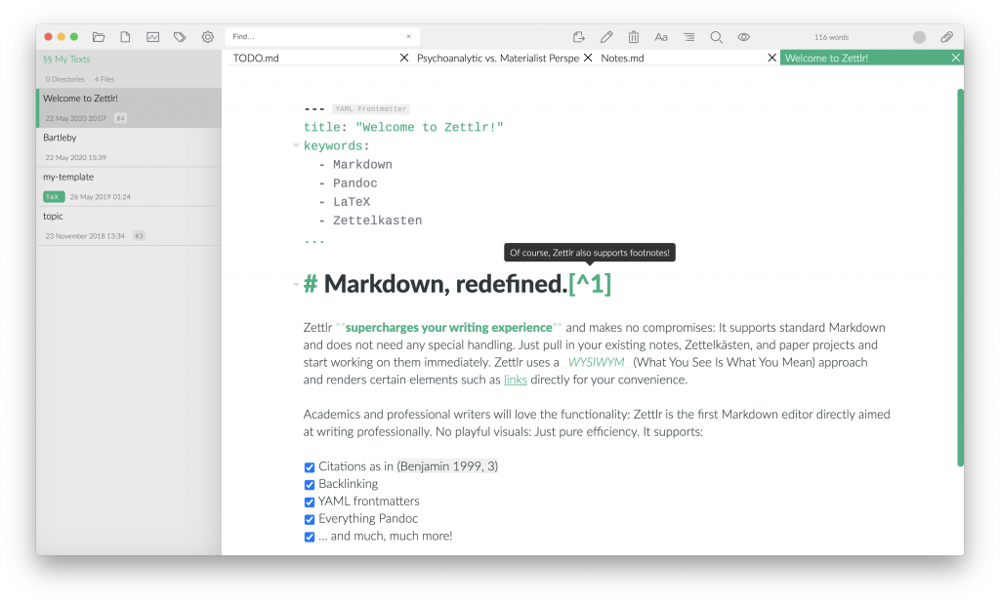

## Zettlr

### Qu'est-ce que Zettlr ?

**Zettlr est un éditeur de document en Markdown "Académique" qui possède des fonctions complémentaires à celles de Joplin.**

### Qu'est-ce que permet de faire Zettlr ?

Zettlr permet de :

- Éditer des documents en Markdown avec une interface bien plus proche de celle de Microsoft Word ou Libreoffice.
- Insérer et gérer des références bibliographiques au sein d'un document en Markdown.
- D'exporter votre document en Markdown dans des formats que Joplin n'est pas encore capable de gérer : `.docx` (document Word), `.odt` (document Libreoffice), `.html` (page web), et bien d'autres encore.
- Gérer des projets entiers (comme des mémoires, une thèse, un rapport, etc.) en Markdown, avec les chapitres séparés en différents fichiers.

> `r emo::ji("light_bulb")`  *Zettlr est donc un éditeur de documents en Markdown qui permet de compléter Joplin, en proposant des choses que Joplin n'est pas encore capable de faire. Cependant, sachez que Joplin évolue constamment avec le temps, et que certaines de ces fonctionnalités sont déjà sur le plan de route de Joplin ! Zettlr reste cependant un très beau logiciel qui peut être très agréable à utiliser par lui même, et qui propose presques toutes les fonctions de Joplin.*

### Installation de Zettlr

- Rendez vous sur [la page web de Zettlr](https://www.zettlr.com/) pour télécharger l'installateur correspondant à votre  système d'exploitation.
- Lancez l'installateur, et suivez les instructions.

### Prise en main de Zettlr

Zettlr à une interface relativement similaire à Joplin, si ce n'est que Zettlr ne présente pas un éditeur séparé en deux parties comme Joplin. Dans l'éditeur de Joplin, certaines parties du texte en Markdown sont déjà mises en forme, et peuvent être modifiées en les éditant.

- **A gauche** se trouvent les dossiers ouverts de Zettlr.
- **A droite** se trouve l'éditeur de Zettlr.
- **En haut** se trouvent différentes boutons permettant de mettre en forme le document, de l'exporter, etc.
- **Tout en haut à droite** se trouve le bouton pour faire apparaître la barre latérale de Zettlr, qui permet de d'afficher la table des contenus de la note, mais aussi les références bibliographiques qu'elle contient.

### Exercices

#### 1. Connecter Zettlr à la base de donnée Zotero

- Dans Zettlr, cliquez sur l’icône en forme d'engrenage en haut à gauche de la fenêtre pour ouvrir les paramètres, puis rendez vous dans l'onglet `Exporter`.
- Cliquez sur le bouton `Choisir un fichier` à coté du champ `Fichier de référence bibliographique`.
- Dans la fenêtre qui s'ouvre, allez chercher le fichier .json créé précédemment lors des exercices de Zotero.

#### 2. Editer une note de Joplin et insérer 5 références dedans

- Dans Joplin, créez une nouvelle note nommée "Note avec références".
- Toujours dans Joplin, allez dans `Outils`, puis cliquez sur `Options`. Dans l'onglet `Général` des options, dans le champ `Commande de l'éditeur de texte`, appuyez sur le bouton pour sélectionner dans la fenêtre qui s'ouvre l'emplacement du programme Zettlr (sur windows, par défaut, il est installé au chemin `C:\Program Files\Zettlr`).
- Retournez dans la note "Note avec références" dans Joplin. Au dessus de l'éditeur, trouvez la petite icône en forme de carré avec une flèche qui en sort. Elle vous permet d'ouvrir la note présente dans un éditeur externe. Vous pouvez également faire un clic droit sur la note dans le menu des notes, et choisir `Editer dans un éditeur externe`.
- Zettlr va normalement s'ouvrir avec la note. Maintenant, copiez le texte suivant dans la note par Zettlr :

`Différentes articles ont été publiés à propos des logiciels open-source [ ].`

- Dans la partie entre crochets, indiquez les 5 références de tous les articles enregistrés dans les exercices de Zotero. Pour indiquez une référence, tapez le symbole `@`, puis cherchez dans la liste d'auto-complétion la référence dont vous avez besoin.

> `r emo::ji("light_bulb")`  *Pour faire différentes références ensembles, il suffit de faire des crochets, et de faire plusieurs références commençant par `@`, et séparées par le symbole `;`. Cela donne quelque chose comme `[@bretthauerOpenSourceSoftware2001; @fuggettaOpenSourceSoftware2003]`.*

#### 3. Voir les références dans la barre latérale

- Ouvrez la note  "Note avec références" dans Zettlr.
- En haut à droite de Zettlr, trouvez le bouton pour afficher la barre latérale.
- Dans la barre latérale, trouvez le bouton pour afficher les références du document.
- Observez les détails des références que vous avez insérez dans votre texte. Les retrouvez-vous toutes ?

#### 4. Exporter le fichier Markdown en .docx ou en .odt

- Ouvrez la note  "Note avec références" dans Zettlr.
- En bas de la note, faite un titre de premier niveau nommé "Références" (`# Références`).
- En haut de la fenêtre Zettlr, trouvez le bouton `Exporter le fichier courant`.
- Exportez la note en `.docx` ou en `.odt` et ouvrez la dans ce format.

#### 5. Découvrir le mode sans distraction

- Ouvrez la note  "Note avec références" dans Zettlr.
- Allez dans l'onglet `Affichage` de Zettlr, puis cliquez sur `Mode sans distraction`, ou bien faites `Ctrl + J`.
- Observez les changements de l'interface.
