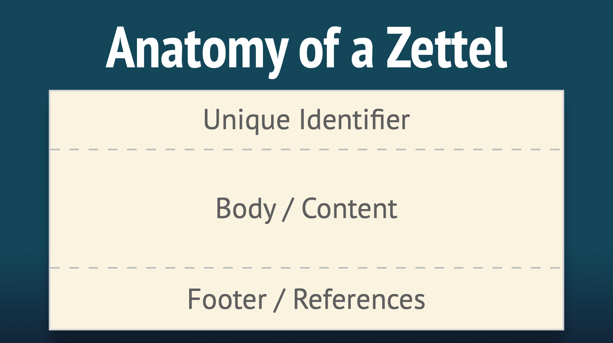

## La méthode *Zettelkasten*

### Qu'est-ce que le *Zettelkasten* ?

Le *Zettelkasten* est une méthode de gestion des connaissances et de prises de notes.

Le mot *Zettelkasten* provient de l'allemand, et pourrait être traduit par "boite à notes" ou "boites à idées".

C'est une méthode utilisée dans la recherche scientifique ou dans les études; cependant, elle peut aussi vous être utiles pour organiser votre culture générale.

Cette méthode à été développée par Conrad Gessner au 16eme siècle, et a été utilisée par différents chercheurs.euses depuis. En particulier, Nijlas Luhmann (sociologue Allemand) avait un *Zettelkasten* de 90 000 cartes, auquel il a attribué une grande partie de sa proficience en écriture (plus de 70 livres et 400 articles scientifiques au cours de sa vie).

### A quoi sert le *Zettelkasten* ?

Le *Zettelkasten* sert à prendre en note de la connaissance et du savoir à l'aide d'un logiciel, ou de papiers.

Cette méthode possède plusieurs particularités très importantes :

1. **Elle permet faciliter le classement de cette connaissance afin de la retrouver très rapidement.**

C'est le cas car les informations y sont classées de manière très organisée.

2. **Elle permet de classer l'information d'une manière très simple et instinctive.**

Si vous vous intéressez à la religion et à la philosophie, et que vous voulez faire une note à propos du fameux "[Pari de Pascal](https://fr.wikipedia.org/wiki/Pari_de_Pascal)"; est-ce que vous rangerez cette note dans la catégorie "religion", ou dans la catégorie "philosophie" ? Dans un *Zettelkasten*, cette question ne se pose pas, car il n'y a pas de catégories. Cela rend le fait de classer ou de retrouver votre note bien plus instinctif.

3. **Elle permet  de facilement voir les connections qui peuvent exister entre différentes connaissances.**

Ceci permet alors une forte créativité par la perception de  liens entres des informations que, autrement, nous aurions vues comme séparées.

4. **Elle permet d'encapsuler l'information.**

Pour comprendre l'encapsulation, imaginez la situation suivante : vous décidez de créer un site web qui parle des éléphants. Sur votre site, vous avez une page qui parle de qu'est-ce que les éléphants font de leurs journées; et une autre qui parle de l'effet des bouses d'éléphants sur leur environnement. Vous comprendrez très vite que ces deux pages vont devoir parler, à un moment ou à un autre, de ce que les éléphants mangent. Ainsi, vous avez le choix : vous pouvez écrire à propos de ce que les éléphants mangent dans ces deux pages, ce qui vous oblige à ré-écrire l'information deux fois. De plus, si cette information est modifiée (par exemple, une nouvelle découverte est faite sur le régime alimentaire des éléphants), vous devrez modifier les deux pages. Cependant, vous pouvez aussi faire une page qui parle de ce que les éléphants mangent, et simplement créer un lien vers cette page dans vos deux autres pages. En ce faisait, vous n'avez pas à ré-écrire l'information plusieurs fois, et vous n'aurez à la modifier qu'une seule fois si besoin est. Vous avez ainsi encapsulé l'information à propos de ce que les éléphants mangent en la séparant du reste, et en indiquant des liens vers celle-ci la ou cela est nécessaire.

5. **Elle évite de devoir chercher de l'information dans des longues notes ou de longs textes.**

Ceci est une conséquence de l'encapsulation de l'information. Pour reprendre l'exemple précédent, vous n'aurez pas à écumer une des deux longues pages sur le quotidien ou les effets des bouses des éléphants pour savoir ce qu'ils mangent. Vous n'aurez qu'a retrouver la bonne page, ou la bonne note, pour trouver la bonne information.

6. **Elle rend le fait de prendre des notes plus agréable.**

Cet aspect est certainement le plus subjectif, mais il me semble indéniable. Prendre des notes sur des sujets compliqués est souvent une activité chronophage, et il peut être très décourageant de se retrouver avec un tas de notes longues et complexes qui ne servent pas bien nos buts, et qui semblent au final inutiles. Le *Zettelkasten* permet alors de rendre l'activité de prendre des notes sur tout et n'importe quoi - comment identifier une espèce d'arbre, des statistiques liés à un problème dans le monde qui nous touche, des pensées qui nous traversent - organisée, rigoureuse, et surtout productive. Chacune des notes crées au sein d'un *Zettelkasten* invite à la réflexion et à la création. Chacune des notes peut être retrouvée rapidement pour vous servir quand cela est nécessaire. Ainsi, cette activité devient moins laborieuse, moins bourrée de doutes, et beaucoup plus satisfaisante. Chaque note devient une graine plantée dans le sol qui donnera ses fruits à l'avenir.

### Mettre en place un *Zettelkasten*

Aujourd'hui, il est très simple de mettre en place un *Zettelkasten* par le biais d'un logiciel comme Joplin. Elle demande cependant un tout petit peu de pratique.

Un *Zettelkasten* doit respecter trois grands principes, que nous allons énoncer ici.

#### Les principes du *Zettelkasten*

1.**Le *Zettelkasten* doit être composé de notes qui respectent le "principe de l'atomicité".**

Derrière ce nom compliqué se cache une réalité simple : vos notes doivent être aussi courtes que possibles, et doivent considérer un sujet très précis en particulier. C'est l'atomicité : tout comme un atome est définit comme un objet qui n'est pas séparable en plusieurs parties/coupables, vos notes devraient, autant que possible, ne pas pouvoir être séparée en d'autres notes. Cela permet d'encapsuler l'information autant que possible, et d'éviter les très longues notes qui peuvent être cauchemardesques pour s'y retrouver. Des petites notes vont aussi permettre de faire des liens plus facilement entre notes (voir plus bas).

Dans la pratique, il est tout à fait normal de commencer à écrire des notes courtes; puis, au fur et à mesure qu'elles s'allongent si on y rajoute des choses, de les séparer en plusieurs notes. Dans le *Zettelkasten*, les notes sont appelées des *Zettel*, qui signifie en allemand..."note" ! Ainsi, chaque *Zettel* doit respecter le principe de l'atomicité.

2. **Le *Zettelkasten* ne doit pas être textuel, mais *hyper-textuel*.**

La encore, derrière ces mots compliqués se cache une réalité simple.

Imaginez un instant si l'encyclopédie en ligne Wikipédia n'était pas composée d'un très grand nombre d'articles différents (comme c'est le cas actuellement), mais d'une seule page web contenant toute l'information de Wikipédia ? Si c'était le cas, l'encyclopédie Wikipédia serait sous forme "textuelle" classique : un long texte linéaire ayant un début et une fin. Pour y trouver la bonne information, il faudrait regarder ce qui se trouve entre ce début et cette fin, et notre lecture serais toujours guidée dans ce sens la.

Heureusement, Wikipédia n'est pas une encyclopédie textuelle, mais hyper-textuelle. Cela veut dire qu'elle est composée de documents (articles) reliés entre elles par des hyperliens. Ces hyperliens, vous les connaissez bien : ce sont tout simplement les liens que vous trouvez sur des pages internet, et sur lesquels vous avez l'habitude de cliquer.

L'organisation hyper-textuelle permet d'éviter de structure l'information de manière linéaire (depuis un début jusqu’à une fin), et de rendre son écriture - et son accès - tout à fait "organique". Dans Wikipédia, les articles se créent et se relient les uns aux autres au fur et à mesure, selon la nécessité de les écrire. L'ordre dans lequel ces articles sont écrit importe peu; et l'ordre dans lequel ils sont lu n'importe pas non plus. L'important est la présence de connections et de liens entre eux.

Il en va de même pour un *Zettelkasten*, qui est d’ailleurs souvent comparé à un "Wikipédia personnel". Dans un *Zettelkasten*, la priorité n'est pas tant la collection d'information; mais la connection des informations entre elles. Pour cela, les *Zettels* (notes) contenues dans un *Zettelkasten* vont toutes avoir un identifiant unique, comme une page web. Cet identifiant va permettre de créer des connection entre les *Zettels*, tout comme des liens entre des pages wikipédia.

3. **Il y a une *Zettelkasten* pour une personne, et une personne par *Zettelkasten*.**

Un *Zettelkasten* doit être personnel, et plusieurs personnes ne devraient pas travailler ensemble sur un même *Zettelkasten*. La raison pour cela est que nous sommes tous.tes très différents.es dans la manière que nous avons de choisir, enregistrer, et connecter l'information avec laquelle nous entrons en contact. Ainsi, ce qui fera du sens pour une personne ne fera pas forcément de sens pour une autre. Un *Zettelkasten* doit être extrêmement confortable pour vous. Et bien que vous ne vous rappellerez pas toujours de tout ce que vous avez noté.e, et de la manière dont vous avez fait des connections, celles-ci vous paraîtrons compréhensibles lorsque vous les retrouverez quand le besoin se fera. Il est aussi important pour votre mémoire et pour votre apprentissage que vous soyez celui ou celle qui prend le temps de faire les notes, afin d'en prendre l'habitude, et afin de mieux retenir l'information qui s'y trouve.

En plus de tout cela, un *Zettelkasten* peut contenir des choses très personnelles. Je ne parle pas forcément de mots de passes, ou bien de vos coordonnées bancaires : bien que ces informations peuvent aller dans un *Zettelkasten*, ceci n'est pas recommandé. Cependant, votre *Zettelkasten* pourra contenir des notes à propos de vos émotions; de vos pensées; ou de votre vécu. Il est alors important que vous vous sentiez confortable avec l'idée de coucher ces mots dans des notes, en sachant qu'ils ne seront pas lu par quelqu'un d'autre que vous si vous ne le souhaitez pas.

Votre *Zettelkasten* sera à vous; une véritable maison de campagne pour vos pensées et vos idées.

#### L'anatomie du *Zettelkasten*

Maintenant que vous nous avons vu les grands principes du *Zettelkasten*, il est temps de voir comment le mettre en place, pratiquement.

Commenceons par les composants les plus importants : Les *Zettels*, les étiquettes, les liens, et les boites.

##### Les *Zettels*

Une *Zettel* est une note, et elle est le composant de base du *Zettelkasten*.

Une *Zettel* est composée de trois parties :

1. Un identifiant unique
2. Un corps/contenu
3. Un bas de page qui contient des références

Et c'est tout !

Lorsque l'on fait un *Zettelkasten* en format papier, il est important d'avoir une méthodologie bien définie pour ce qui est de choisir l'identifiant unique de chaque *Zettel*. Mais lorsque l'on fait un *Zettelkasten* avec un programme comme Joplin (ce que je vais vous proposer ici), pas besoin de s'en inquiéter !

En effet, lorsque Joplin créer une nouvelle note, celle-ci est automatiquement associée à un identifiant unique aléatoire qui ne changera pas, même si l'on change le titre de la note. On peut voir celui-ci en cliquant sur l’icône permettant de voir les propriétés de la note dans Joplin, tout en haut à droite de l'interface.

Le corps ou contenu de la note doit être clair et concis. Si il devient trop long, alors il serait très intéressant de voir si la note peut être séparée en plusieurs notes, qui resterons aussi courtes que possibles. Il est important, autant que possible, que ce sois vous qui écriviez le corps de la note. Cela vous pousse à écrire votre propre version de l'information, ce qui mène à mieux la comprendre, mais aussi à mieux s'en rappeler. Ainsi, autant que possible, **évitez de simplement copier-coller de l'information dans une note**.

Le pied de la note, contenant les références, peut être généré automatiquement par le logiciel si celui-ci gère les références bibliographique (c'est le cas de Zettlr, et ce sera bientôt le cas de Joplin en 2021). Si la note contient des pensées, vous pouvez laisser cette partie la vide.

##### Les étiquettes

Rappelons nous ce qui a été dit plus tot : un *Zettelkasten* n'as pas de catégories.

Cela signifie que les *Zettles* ne seront pas classée dans une catégorie ou une autre. A la place, le *Zettelkasten* utilise des étiquettes.

La différence entre les étiquettes et les catégories est importante à comprendre. Une catégorie pourrait être vue comme une boite; une étiquette, comme une petite étiquette de couleur que l'on pourrait coller sur une note. Ainsi, une note ne peut avoir qu'une seule catégorie (elle ne peut être déposée que dans une seule boite), mais elle peut avoir plusieurs étiquettes.

Ainsi, dans le *Zettelkasten*, on ne classera jamais les notes pour catégorie. Lorsqu'une note est crée, vous n'aurez qu'a réfléchir aux étiquettes que vous voudrez lui associer. Par un exemple, une note sur ce que les éléphants mangent pourrait avoir les étiquettes `éléphants`, `nourriture`, et `biologie`. Le procédé est bien plus "organique", et bien plus simple : il n'y a plus vraiment d'hésitation pour savoir ou mettre votre note. Il vous suffit juste de mettre les étiquettes qui vous semble correspondre à celle-ci. Ca tombe bien, car Joplin gère très bien les étiquettes !

Les étiquettes sont importantes pour pouvoir facilement faire des liens entre vos notes, de manière très créative. Par exemple, en regardant toutes vos notes avec l'étiquette `nourriture`, vous trouverez peut être des relations intéressantes entre ce que mangent différentes espèces pour lesquelles vous avez pris des notes.

##### Les liens

Les liens entre *Zettles* sont très importants dans un *Zettelkasten*. Ce sont eux qui vont vous permettre de retrouver facilement de l'information, de la structurer, mais aussi d'y percevoir des choses que vous n'auriez pas vu autrement.

Un lien dans une *Zettle* fonctionne exactement comme un lien dans wikipédia, qui va vous amener sur un autre article. Pour faire ce lien, il suffit d'utiliser l'identifiant unique (ID) de la *Zettle* vers laquelle vous voulez faire le lien.

Dans Joplin, il est possible de très facilement faire un lien en Markdown que vous pourrez cliquer pour vous rendre sur une autre note, comme si vous naviguiez sur un site internet ! Pour cela, il suffit de faire un clic droit sur la note vers laquelle vous souhaitez faire le lien dans la liste des notes de Joplin, et de choisir `Copier le lien Markdown`. Vous pourrez ensuite coller ce lien où bon vous semble.

Joplin possède également un plugin qui permet de faire des liens rétroactifs. Cela veut dire que si vous lisez une note qui est visée par un lien présent dans une autre note, le plugin vous indiquera, dans la note mise en forme, un lien rétroactif vers cette note. Cela revient à vous permettre de naviguer dans les deux sens (aller-retour) entre deux notes très facilement et sans efforts, mais aussi à encore mieux voir les connection qui existent entre votre notes.

##### Les boites

Comme nous l'avons dit, un *Zettelkasten* ne possède pas de catégories. Cependant, il peut être très utile d'en définir une ou deux qui ne sont pas relatives au contenu des notes, mais à leur type.

Par exemple, vous pouvez avoir une catégorie/une boite nommée "notes à écrire". Dans cette catégorie, vous laisserez les notes que vous n'avez pas eu le temps de completer proprement, et pour lesquelles vous avez très rapidement griffonné quelque chose pour la terminer plus tard.

Vous pouvez aussi avoir une catégorie "notes d'indexages", qui contient des notes qui servent de "sommaires" pour différents thèmes, et qui vous permet de rapidement accéder à l'information. Par exemple, vous pourriez faire un note nommée `Informations sur les éléphants`, qui contiendra de nombreux liens vers des notes qui parlent des éléphants. Ainsi, vous pourriez utiliser ces notes d'indexage pour aller chercher de l'information quand vous avez besoin de la retrouver.

Il n'y a vraiment pas de limite à ce qui peut être fait. La seule chose importante est que ces catégories ne doivent pas toucher au contenu des notes, pour éviter toute ambiguïté sur la catégorie/boite où la note doit être placée.

#### Utiliser un *Zettelkasten* au quotidien

Vous connaissez maintenant la structure d'un *Zettelkasten* sur le bout des doigts.
