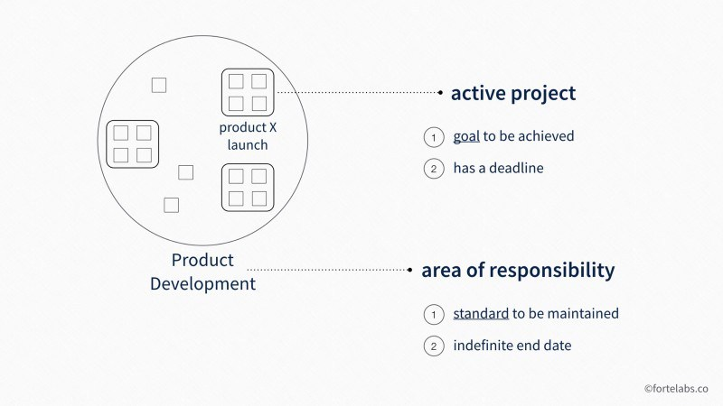
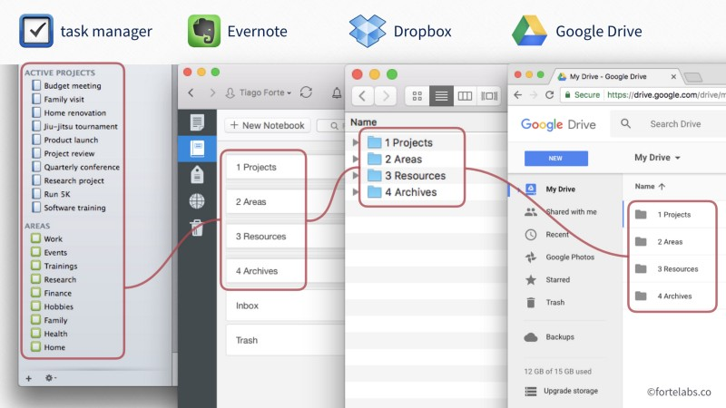

## La méthode P.A.R.A

**La méthode P.A.R.A (Projects, Areas, Resources, Archives) est une méthode pour organiser l'information digitale.**

Elle a été développée par [Forte Labs](https://fortelabs.co/about-forte-labs), une compagnie qui créer du contenu ayant pour but d'aider à augmenter sa productivité à l'aide de la technologie.

### Utilité de la méthode P.A.R.A

La méthode P.A.R.A permet d'organiser votre information digitale en différentes catégories, afin qu'il vous soit facile de vous organiser avec elle. **Elle permet de savoir où trouver l'information dans votre organisation globale, et pourquoi**.

Ces mots peuvent vous paraître flous, mais prennent tous leurs sens en prenant en compte tout ce que vous avez vu dans cet atelier jusqu’à maintenant. Vous avez découvert des outils pour prendre des notes, écrire des taches, organiser des projets; mais vous voila maintenant face au fait que vous souhaiteriez essayer une nouvelle recette de cuisine qui vous a beaucoup intéréssé.e. Où mettez vous cette recette ? Dans vos notes ? Vos taches ? Vos projets ? Ou la garderez vous, une fois que vous l'aurez terminée ?

La méthode P.A.R.A permet de répondre à ces questions avec le moins d'efforts possible. Vous vous rendez sûrement compte que cela vous est très important; car avoir beaucoup d'outils différents, adaptés à des besoins différents peut se révéler confusant.

### Mettre en place la méthode P.A.R.A

La méthode P.A.R.A s'utilise un peu comme une "carte" qui vous guidera dans l'utilisation de vos différents outils d'organisation.

Globalement, on peut se l'imaginer comme une manière de "trier" des informations selon deux charactéristiques : **leur utilité** (a quoi sert-elle ?), et **leur format** (quel est son format ? Sur quel logiciel ?).

#### Trier les informations selon leur utilité

Pour comprendre comment la méthode P.A.R.A trie les informations selon leur utilité, il suffit de comprendre les 4 éléments qui composent son nom : Projet, Aire de responsabilité, Ressource et Archive.

- Un **projet** est définit comme "*une série de taches liées à un but, **avec une deadline***".

Des exemples de projets peuvent être "préparer les vacances de cette année"; "Écrire un post de blog"; ou encore "acheter un nouvel ordinateur". Ils ont tous un but précis, et une date limite qui leur est implicite. En bref, la manière la plus simple de savoir si une chose est un projet est de savoir si cette chose est censée se terminer dans un temps donné, après avoir accomplis différentes taches. **Toute information relative à un projet ira donc dans des fichiers liés aux projets**.

**Bien comprendre ce qui est un projet ou non est très important dans la méthode P.A.R.A**. L'une des raisons à cela est que identifier des projets permet d'identifier ce que l'on complète et ce que l'on termine, c'est qui est très motivant. A l'inverse, si vous confondez projet et aire de responsabilité (voir ci dessous), vous prenez le risque de ne pas réaliser cet avancement, ce qui est important pour votre moral sur le cour terme; mais aussi pour mesurer votre productivité sur le long terme. Qu'avez vous fait, l'année dernière ?

- Une **aire de responsabilité** est définie comme "*une sphère d'activité avec un standard à maintenir à travers le temps*."

Les aires de responsabilités peuvent être "ma santé"; "mes amis"; "le badminton"; "mon appartement". Ce sont ainsi des parties de votre vie, aux limites plutôt bien définies, qui ne représentent pas des projets, mais qui vont vous demander de quotidiennement réaliser des taches. Ces taches ne sont pas liées à un but précis qui se terminera à un moment déjà déterminé. Ainsi, s'occuper de ses amis ne représente pas un projet, mais bien une partie de votre vie avec certaines responsabilités. De même, votre projet d'écrire un post sur votre blog pourrait vous demander des taches aujourd'hui; mais aller chiner pour trouver un beau vêtement pour l'anniversaire de votre meilleure amie demain l'est aussi. Distinguer projet et aire de responsabilité permet cependant d'utiliser des outils différents - mais adaptés - aux deux.

Une dernière chose à retenir est que **vos projets s'inscriront quasiment toujours au sein d'une aire de responsabilité**, ce qui est tout à fait normal ! Vous pouvez visualiser les choses comme sur le schéma suivant, où les petits carrés représentent des taches, et le cercle une aire de responsabilité.

- Une **ressource** est définie comme "*un sujet ou un thème d’intérêt pour vous*".

Une ressource peut donc être des connaissances concernant l'espace, la musique, le jardinage, le marketing, la psychologie, ou même...l'organisation. Bref, des ressources seraient tout ce que vous pourriez classer dans un *Zettelkasten* ! Il faut cependant distinguer une ressource (comme un article très intéressant en psychologie) d'une information (comme l'adresse du magasin ou vous irez chiner pour l'anniversaire de votre meilleure amie). Cette distinction est importante, car une information n'as pas besoin d'être sauvegardée d'une manière aussi lisible qu'une ressource, ce qui permet d'économiser du temps.

- Une **archive** concerne simplement "*des objects inactifs des trois autres catégories*".

Les archives contiendraient ainsi des informations sur des projets qui ont été complétés (vous avez finit le post sur votre blog); des aires de responsabilités qui ne font plus partie de votre vie (vous avez arrêté le badminton); ou bien des ressources qui ne vous intéresse plus (vous ne regardez plus l'animé *Mew Mew Kissy Cutie* dont vous etiez fan auparavant).

Maintenant que vous avez compris comment la méthode P.A.R.A trie les informations par utilité, voyons comment elle les trie par format.

#### Trier les informations selon leur format

Les informations digitales peuvent être sous différents formats : un simple fichier texte, une image, un lien vers une page internet, un fichier Microsoft Word, une musique, une tache à cocher, et bien d'autre. La méthode P.A.R.A demande de préciser ces distinctions de manière simple et compréhensible, afin que vous n'hésitiez pas un instant à propos de où mettre votre information.

La méthode P.A.R.A ne donne pas une liste de logiciels particulier à utiliser : c'est à vous de faire vous définition. Cependant, 3 règles doivent être réspéctées autant que possible :

1. **Limitez le nombre de logiciels** que vous utilisez principalement pour gérer ou sauvegarder votre informations digitale **au nombre de 4**. La raison derrière ce chiffre est qu'il semble être une limite importante dans la mémoire à cours terme de notre cerveau. Ainsi, le dépasser rend les choses beaucoup plus complexes à gérer mentalement, et ne donne souvent pas beaucoup de gain. **Faire plus avec moins** est toujours une excellente doctrine !

2. **La structure des utilités d'informations doit être identique dans chaque logiciel**. Cela signifie que dans chaque logiciel, vous retrouverez des catégories comme "Projets", "Aires", "Ressources" et "Archives"; et que au sein de ces catégories, l'organisation qui s'y trouvent doit se retrouver dans chacun des logiciels que vous utilisez. Ceci est important afin d'avoir une structure unique que vous retrouverez dans tous vos logiciels, ce qui réduit votre charge mentale, rend le passage d'un logiciel à un autre plus rapide, et vous évite de chercher longuement pour trouver une information. Sur les images suivantes, vous trouverez un example de cela avec 4 logiciels différents. **Attention cependant** : tous les logiciels n'ont pas à contenir tous les types d'informations possibles ! Ainsi, votre gestionnaire de tache n'as pas forcément besoin de contenir des dossiers en liens avec vos ressources ou vos archives.

3. Les logiciels que vous utilisez doivent **permettre de cacher l'information qui ne vous est pas utile autant que possible** lorsque vous travaillez sur quelque chose. Ainsi, lorsque vous travaillez sur un projet, vous n'avez pas besoin d'avoir à votre écran les dossiers et fichiers de vos différentes aires de responsabilités, ou bien vos ressources. Vous n'avez besoin que des informations liées au projet. Ainsi, les logiciels que vous utilisez devraient, autant que possible, être capable de vous cacher toute information non pertinente pour que vous n'ayez pas à trier constamment parmis toutes les informations sur votre écran.

#### Terminer la mise en place de P.A.R.A au niveau technique

Une fois que vous vous serez décidé.e quant aux logiciels que vous utiliserez pour stocker votre information digitale, il ne reste plus qu'a créer la structure de vos dossier dans chacun de vos logiciels. Et voila, tout est prêt !

A partir de maintenant, il ne vous reste plus qu'a mettre vos informations au bon endroit, et dans le bon logiciel. Devez vous prendre rendez vous chez le médecin ? Cela ira sûrement dans une aire de responsabilité nommée "santé", et dans un logiciel de liste de taches ou de calendrier. Voulez vos noter le chiffre intéressant que vous avez vu concernant le nombre d'éléphants qui vivent en Afrique ? Cela ira sûrement dans vos ressource, dans un logiciel de note comme Joplin; peut être même dans votre *Zettelkasten*, qui s'intègre très bien à la méthode P.A.R.A comme section de ressources ! Vous avez terminé votre projet de faire du camping durant l'été ? Alors, déplacez le dossier "Camping" depuis votre zone "Projets" vers votre zone "Archives".

De la même manière, il vous suffira de regarder la bonne section dans le bon logiciel pour retrouver la bonne information. L'adresse du magasin ou vous irez chiner pour votre meilleure amie se trouve sûrement dans une aire de responsabilité "Amis.es", et se trouve sûrement en commentaire d'une tache que vous avez mis dans votre gestionnaire de taches à ce sujet. Le document word qui contient des données importantes pour votre travail se trouve sûrement dans votre gestionnaire de fichiers, dans le dossier du projet qui lui correspond. Quant aux informations que vous avez gardé en lien avec les cours de badminton que vous prenez, ils se trouvent forcément dans vos archives.

Comme vous le voyez, déposer et retrouver l'information devient donc plus facile. Cela est très utile lorsque l'on commence à en avoir beaucoup, ou bien pour gagner du temps quoi qu'il arrive ! En dehors d'ajouter et de retrouver de l'information, il ne vous restera plus qu'a entretenir votre organisation de temps en temps. Ainsi, lorsqu'une nouvelle aire de responsabilité s'ajoute à votre vie, il vous suffira d'ajouter un dossier correspondant dans chacun des logiciels que vous utilisez.

### Exercices

Durant ces exercices, nous ferons comme si nous avions décidé d'utiliser la méthode P.A.R.A avec l'aide de Joplin, et de différents applications dans Nextcloud.

Ainsi, nous mettrons les taches liées à des projets dans Nextcloud Deck (des kanbans boards); nous mettrons les taches liées à des aires de responsabilité dans Nextcloud Tasks; nous mettrons nos ressources et nos notes dans Joplin; et enfin, nous mettrons nos fichiers dans Nextcloud Files (le gestionnaire de fichiers de Nextcloud, synchronisé avec votre ordinateur).

#### 1. Préparer Nextcloud et Joplin pour utiliser la méthode P.A.R.A

> `r emo::ji("light_bulb")`  *Dans cet exercice, je vous proposerais de remplir Nextcloud et Joplin avec des rubriques qui servent d'exemple. Cependant, n'hésitez pas à les remplir avec des projets ou des aires de responsabilités qui correspondent à votre vie, histoire que vous puissiez utiliser la méthode P.A.R.A dès maintenant !*

- Rendez vous dans Nextcloud Tasks
  - Créez plusieurs listes de taches : "Famille", "Amis", "Travail", "Karaté", "Finances" et "Santé".

> `r emo::ji("light_bulb")`  *Dans la méthode P.A.R.A, à vous de décider combien d'aires de responsabilité différentes vous définirez. Vous pouvez être plus ou moins précis.e : faire une aire "Social", ou bien une aire "Famille", "Amis", etc. Le créateur de la méthode P.A.R.A recommande d'en faire beaucoup plutôt que trop peu, afin de pouvoir mieux trier votre information, mais aussi pour voir plus rapidement si certains aspects de votre vie sont un peu ignorés.*

> `r emo::ji("light_bulb")`  *N'oubliez pas que vous pouvez utiliser des emojis dans les titres de vos aires de responsabilités ! Cela permet de les différencier plus facilement du premier coup d’œil. Par exemple : 🚗 Voiture, 💰 Finances.*

- Rendez vous dans Nextcloud Deck
  - Créez deux nouveau tableaux, en plus de celui créé dans les exercices de Nextcloud : "Achat d'un nouvel ordinateur" et "Fête d'anniversaire de Bastien"

- Rendez vous dans Joplin
  - Créez 4 nouveaux carnets : "1 - Projets", "2 - Aires", "3 - Ressources", "4 - Archives"

> `r emo::ji("light_bulb")`  *Les chiffres dans les titres de vos carnets servent à faire en sorte que Joplin les garde organisés dans le bon ordre.*

  - Dans le carnet "1 - Projet", créez trois nouveaux carnets : "Atelier open-source et organisation", "Achat d'un nouvel ordinateur" et "Fête d'anniversaire de Bastien".
  - Dans le carnet "2 - Aires", créez 6 nouveaux carnets : "Famille", "Amis", "Travail", "Karaté", "Finances" et "Santé".
  - Dans le carnet "3 - Ressources", déplacez le carnet "Zettelkasten" créé dans les exercices du sur le Zettelkasten.

- Rendez vous dans le dossier "Nextcloud" de votre ordinateur (qui est normalement synchronisé avec votre compte Nextcloud sur Cloudamo, depuis les exercices sur Nextcloud)
  - Créez 4 nouveaux dossiers : "1 - Projets", "2 - Aires", "3 - Ressources", "4 - Archives"
  - Dans le dossier "1 - Projet", créez trois nouveaux dossiers : "Atelier open-source et organisation", "Achat d'un nouvel ordinateur" et "Fête d'anniversaire de Bastien".
  - Dans le dossier "2 - Aires", créez 6 nouveaux dossier : "Famille", "Amis", "Travail", "Karaté", "Finances" et "Santé".

> `r emo::ji("light_bulb")`  *Et voila, vous êtes maintenant prêts à utiliser la méthode P.A.R.A ! Si vous avez utilisé des projets et des aires qui correspondent à votre vie, n'oubliez pas de transférer les fichiers et informations que vous avez déjà dans les logiciels correspondants.*

#### 2. Travailler sur un projet avec la méthode P.A.R.A

- Ouvrez Nextcloud Deck, Joplin et le dossier Nextcloud de votre ordinateur.
- Dans Nextcloud Deck, choisissez le tableau "Fête d'anniversaire de Bastien". Fermez le menu de gauche à l'aide du petit bouton en haut à gauche de l'interface.
- Dans Joplin, rendez vous dans le carnet "Fête d'anniversaire de Bastien". Appuyez sur F10 pour cacher le menu des carnets (appuyez sur F10 pour le faire réapparaître si besoin est).
- Dans votre dossier Nextcloud, rendez vous dans le dossier "Fête d'anniversaire de Bastien".
- A présent, essayez d'inventer une fête d'anniversaire pour votre fictionnel (ou réel) ami Bastien.
  - Dans Nextcloud Deck, créez les cartes "Trouver l'endroit", "Trouvez l'heure", "Déterminer qui est invité", et "Déterminer les activités" dans la colonne "A faire"
  - Déplacez les cartes dans Nextcloud Deck au fur et à mesure que vous complétez les taches. N'hésitez pas à faire des fiches dans Joplin, à insérer des détails dans la description de vos cartes dans Nextcloud Deck, ou bien a creer ou enregistrer des fichiers dans votre dossier Nextcloud pour se faire.

> `r emo::ji("light_bulb")`  *Avez vous remarqué durant l'exercice que le fait d'avoir limité la visibilité de l'information qui n'était pas pertinente pour votre projet vous à aidé à vous concentrer ? Partout ou se tournait votre regard, vous n'aviez que des ressources liés à votre projet; de cette manière, nous avons limité le travail qu'avait à faire votre cerveau pour identifier ce qu'il était important dans ce qu'il voyait. Ce genre de choses n'est pas à sous-estimer lorsque l'on travaille pendant longtemps sur un ordinateur.*

#### 3. Mettre vos ressources au bon endroit avec la méthode P.A.R.A

- Ouvrez Nextcloud Deck, Joplin et le dossier Nextcloud de votre ordinateur, et tachez de mettre les informations suivantes au bon endroit :
  - Votre amie Julia souhaiterait venir à l'anniversaire de Bastien.
  - Vous devriez réviser votre *kata* pour passer votre ceinture de Karaté la semaine prochaine.
  - Cette citation du *Seigneur des anneaux* à propos de la justice et de la moralité : "*Nombreux sont ceux qui vivent et méritent la mort. Et certains qui meurent méritent la vie. Pouvez-vous la leur donner ? Alors ne soyez pas trop prompt à dispenser la mort en jugement.*"
  - Cette [image d'une veille carte du monde](https://i.pinimg.com/originals/ba/59/94/ba5994829ba487b5f00b0d7f643a6f58.jpg) que vous trouvez très jolie.
  - Vous avez décidé que vous aimeriez bien acheter un ordinateur portable plutôt qu'une tour, car votre ordinateur portable actuel ne marche plus très bien, et vous vous déplacez souvent.

> `r emo::ji("light_bulb")`  *Certaines de ces ressources sont plus faciles à placer que d'autres : les informations sur l'anniversaire de Bastien et l'achat d'un nouvel ordinateur pourraient facilement aller dans Nextcloud Deck. La citation du seigneur des anneaux pourrait aller dans votre Zettelkasten, et la révision de votre kata devrait aller dans Nextcloud Tasks avec une date limite pour la tache. L'image de la vieille carte du monde, cependant, pourrait être insérée dans une note Joplin, ou bien directement déposée dans votre dossier Nextcloud.*
