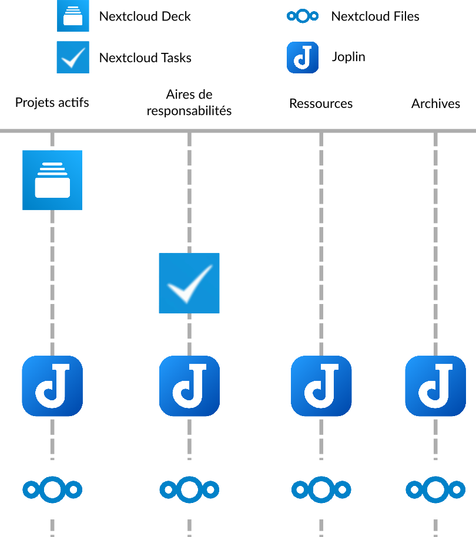
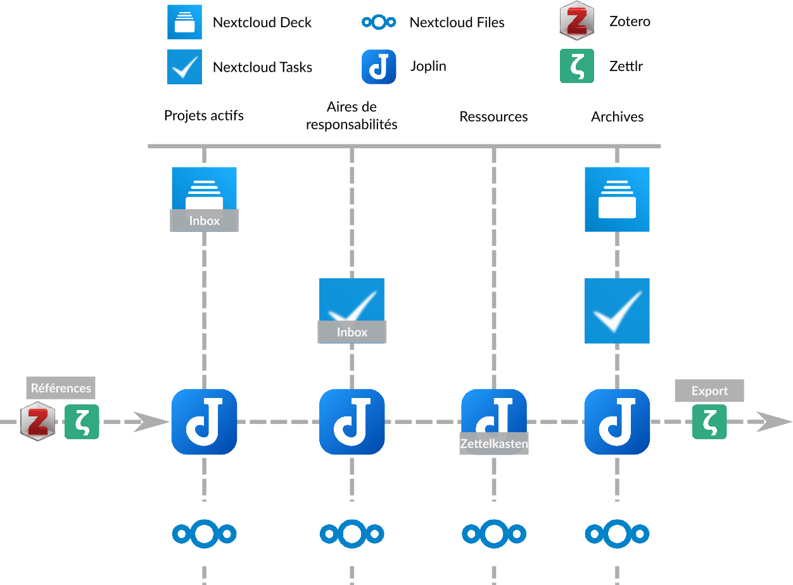

## Un exemple de combinaison de tous ces outils et méthodes

Nous avons à présent vu quatre logiciels différents qui aident à l'organisation - Joplin, Zotero, Zettlr et Nextcloud. Nous avons également survolé trois méthodes d'organisations différentes - le *Zettelkasten*, la méthode P.A.R.A et l'*inbox*, et vous avez sûrement déjà compris comment ces logiciels peuvent s'utiliser avec ces différents méthodes. Vous avez aussi commencé à expérimenté les interactions entre ces 3 méthodes, qui ne sont pas mutuellement exclusives, car elles peuvent se compléter.

Je vous propose ainsi un petit récapitulatif en vous présentant un example de combinaison de ces logiciels et de ces méthodes ensembles.

### La structure globale : la méthode P.A.R.A

**La méthode P.A.R.A définit la structure globale de cet example**. Pour mieux la comprendre, je vous réfère à la section sur la méthode P.A.R.A.

Ainsi, 4 logiciels sont utilisés :

- Nextcloud Deck (qui contient des données relatives à des projets, sous forme de tableaux *Kanban*)
- Nextcloud Tasks (qui contient des données relatives à des aires de responsabilités, sous la forme de taches à cocher)
- Joplin (qui contient des notes relatives aux projets, aux aires de responsabilités, mais aussi à des ressources et aux archives)
- Nextcloud Files (qui contient des fichiers relatifs aux projets, aux aires de responsabilités, aux ressources et aux archives)

On pourrait ainsi représenter l'organisation des logiciels :

### La gestion des ressources : Le *Zettelkasten*

Au sein de la structure globale définie par la méthode P.A.R.A, il est possible d'insérer le *Zettelkasten* comme manière de structure les ressources sur les sujets qui nous intéressent.

C'est Joplin qui va se charger de cette tache, et qui va nous permettre de stocker nos ressources sous la forme d'un *Zettelkasten* dans cet example. Pour plus de détail sur comment un *Zettelkasten* est structuré et fonctionne, je vous réfère à la section le concernant.

### La gestion des taches : la *inbox*

Enfin, les taches définies pour les différentes aires de responsabilités de la méthode P.A.R.A (ici dans Nextcloud Tasks), mais aussi celles définies pour nos différents projets (ici dans Nextcloud Deck) peuvent être gérée à la manière d'une *inbox*.

Ainsi, toutes les taches dans Nextcloud Tasks et cartes dans Nextcloud Deck peuvent être associés à des priorités, puis être triées par priorité afin de rapidement visualiser quelles taches doivent être faites. Pour en savoir plus sur la gestion des taches à la manière d'une inbox, je vous réfère à la section sur cette méthode.

### La gestion des références dans les ressources : Zotero et Zettlr

Au sein même du *Zettlekasten*, ou bien dans d'autres notes qui concernent vos projets ou vos aires de responsabilités, il vous est possible d'insérer des références bibliographiques en utilisant Zotero et Zettlr.

De cette manière, vous aurez des documents propres et référencés sans avoir à gérer vous même, à la main, une base de données de références (ce qui peut être très compliqué). Pour plus d'informations sur l'utilisation de ces deux logiciels, je vous renvoie à leurs sections respectives.

> `r emo::ji("light_bulb")`  *Un plugin pour Joplin est en train d'être développé, à l'été 2021, dans le but de pouvoir insérer des références en markdown dans Joplin. Cela vous permettra de ne pas avoir à passer par Zettlr pour cela.*

### L'export des documents en markdown avec Zettlr

Zettlr peut aussi jouer le role d'un bon exporteur de documents en langage markdown. Bien que Joplin est capable d'exporter vos notes en markdown au format `.pdf` ou `.html`, Zettlr est capable de le faire dans un plus grand nombre de format, et aussi d'y ajouter des références. Zettlr peut être utilisé pour ouvrir vos notes Joplin sans aucuns soucis.

### Graphique récapitulatif

Au final, voici la structure de cette example, à travers les différents logiciels utilisés :

