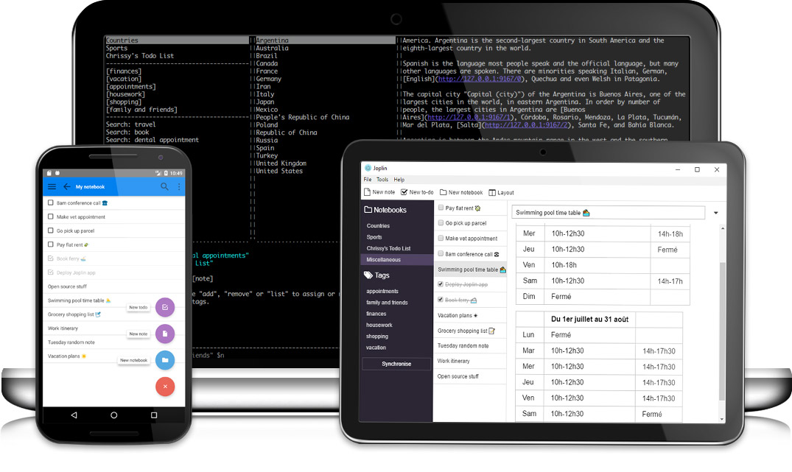

```{r setup, include=FALSE}
knitr::opts_chunk$set(echo = TRUE)
```

<!-- Pour inserer les emojis, voir l'utilisation du package emo : https://github.com/hadley/emo-->

# Introduction

- **Nos vies modernes nous mettent constamment en contact avec de l'information**. Tellement d'informations qu'il peut être très difficile de la structurer, mais aussi de la retrouver.

- **Différents logiciels existent aujourd'hui pour alléger le travail que nous demandons à notre cerveaux pour gérer ces informations**. Cependant, ces logiciels sont souvent possédés par des grandes entreprises qui maintiennent un flou sur leur accès aux données entreposées, et sur leur partage à d'autres compagnies ou agences de renseignement. Ils présentent aussi des méthodes ou des fonctionnements parfois très rigides, et qui ne sont peut être pas adaptés à vous.

- **Il est cependant possible de profiter des bons cotés de la technologie afin de pouvoir bien naviguer dans cet océan d'informations, sans pour autant compromettre sa vie privée**. C'est le but de cet atelier, qui vous présentera différents logiciels open-source et gratuits pour vous aider à mieux gérer l'information que vous rencontrez au quotidien, tout en ayant le contrôle sur vos données. Il vous présentera aussi différentes méthodes d'organisation de l'information pour vous aider à mieux la gérer, en bénéficiant du fait d'utiliser différents logiciels complémentaires pour cela.

- **Le but de cet atelier n'est pas de vous présenter une méthodologie rigide que vous devriez suivre à tout prix**. Cet atelier est la pour vous encourage à la découverte et à l’expérimentation, avec un bémol important : retenez bien que la solution parfaite n’existe pas, et que l’expérimentation peut être épuisante si elle se fait sur de trop longues durées. Faites vous confiance, et laissez vous le temps d'essayer un système pendant un moment avant de chercher à le modifier !

# Objectifs de l'atelier

- Découvrir et apprendre à utiliser les fonctions de base des les logiciels suivants :
  - Joplin
  - Zotero
  - Zettlr
  - Nextcloud
- Apprendre à utiliser ces différents logiciels ensemble pour gérer l'information avec les méthodes suivantes :
  - La méthode du *Zettelkasten*
  - La méthode PARA
  - Un exemple d'organisation globale couplant *Zettelkasten* et PARA

# Des logiciels open-source pour s'organiser

## Joplin



### Qu'est-ce que Joplin ?

**Joplin est comme un carnet de notes infini qui vous permet de les classer et de les retrouver de pleins de manières différentes.**

C'est un logiciel open-source et entièrement gratuit qui permet de créer des notes dans le langage d’écriture “Markdown”, en les classant dans des “carnets” (notebooks) et en les associant avec des étiquettes (tags). **Il est une excellente alternative à des logiciels tels que Evernote our Microsoft One Note**.

### Qu'est-ce que permet de faire Joplin ?

Joplin permet d’énormément faciliter son organisation, en remplaçant en un seul endroit tout besoin de post-its, de carnets de notes ou de listes de taches.

En particulier, Joplin vous permet de :

- **Rassembler toute information écrite ou graphique au même endroit** : Vos notes de cours, vos réflexions, vos projets, vos recettes de cuisines, vos listes de courses, vos listes de taches, etc.
- **Retrouver toutes ces informations très rapidement** (quelques secondes) grâce à l’outil de recherche.
- **L’utiliser sur tous types d’ordinateur** (Windows, Mac, Linux) et **sur tous les téléphones** (android, IOs).
- **Synchroniser vos données sur le cloud que vous choisissez** : Nextcloud (voir plus loin), Google Drive, One Drive, etc. Vous pouvez donc avoir toutes vos données écrites partout, tout le temps, sur tous les supports.
- **Sécuriser tous vos textes en les encryptant avec un mot de passe**.
- **Avoir une interface totalement customisable** qui permet de vous concentrer totalement sur ce que vous écrivez pour ne pas perdre de temps.
- D’**exporter vos notes de pleins de manières possible**, avec un format (le markdown) lisible partout et en tout temps.
- **Gérer automatiquement les images et les fichiers que vous insérez dans vos notes**
- **Versionner vos notes automatiquement **(pour revenir en arrière n’importe quand si vous avez fait une bêtise).
- Et bien plus encore.

### Qu'est-ce que le "Markdown" ?


Le markdown est une syntaxe d’écriture facile à lire et à écrire pour formatter du texte qui est très utilisée aujourd'hui. Au passage, sachez que **le document de cet atelier est écrit en markdown !**

La syntaxe se compose d'un set de règles qui permettent d'indiquer, dans un document texte "classique" lisible par tous les éditeurs de texte, comment est-ce que le texte doit être formaté. **Le texte sera ensuite formaté par un logiciel pour le lire, ou bien pour en faire un document à publier ou à partager**.

Voici quelques exemples qui vous permettra de mieux comprendre la syntaxe Markdown :

En markdown, indiquer qu'un mot est en gras s'écrit :

```Le mot **markdown** est en gras.```

Cela rend l'apparence suivante quand mis en forme par un logiciel comme Joplin :

Le mot **markdown** est en gras.

Indiquer un lien s'écrit :

```Un lien vers la [page wikipédia](https://fr.wikipedia.org/wiki/Markdown) du markdown.```

Ce qui donne :

Un lien vers la [page wikipédia](https://fr.wikipedia.org/wiki/Markdown) du markdown.

Pour en savoir plus sur la syntaxe markdown, vous pouvez visiter [la page wikipédia correspondante](https://fr.wikipedia.org/wiki/Markdown), qui contient de nombreux exemples. Mais ne vous inquiétez pas : **Joplin vous propose de nombreux outils et examples pour ne pas avoir à l'apprendre**.

**Les avantages du Markdown sont nombreux** :

- Un document Markdown est un document texte qui peut s'ouvrir avec n'importe quel éditeur de texte (bloc note, Notepad++, Atom, etc.).
- Éditer un document en markdown permet de se concentrer sur le sens de ce que l'on écrit, sans se préoccuper de l'apparence : c'est la philosophie “Ce que vous voyez et ce que vous voulez dire” (What you see is what you mean).
- Un document Markdown peut être lu de différentes manières par les logiciels de mise en page, qui peuvent le transcrire en pleins de format différents (.pdf, .html, etc.) et avec des apparences différentes (police d'écriture, couleurs, etc.).

À lire tout cela, si vous ne connaissez pas encore le Markdown, vous êtes sûrement sceptiques. Mais ne vous inquiétez pas : **Joplin permet de passer outre le Markdown si vous ne l’aimez pas**. Mais vous verrez que l’essayer, c’est l’adopter.

### Installation de Joplin

- Rendez-vous simplement sur [la page web du logiciel](https://joplinapp.org/)
- Choisissez la version correspondant à votre système d’exploitation : Windows, Mac ou Linux.
- Lancez l'installateur et suivez les instructions.

`r emo::ji("light_bulb")` **Si vous souhaitez avoir l'interface en français, pensez à indiquer "français" comme langue durant l'installation**. Si vous ne l'avez pas fait, vous pourrez changer la langue dans “Tools” puis “Options” puis “General”.

### Prise en main de Joplin

#### Interface

Par défaut, la fenêtre de Joplin se compose de 3 parties importantes :

- la liste de vos carnets (notebooks) tout à gauche
- la liste des notes à l’intérieur du carnet ou vous vous trouvez, au milieu
- l’éditeur à droite, qui s’affiche généralement en deux partie (la partie édition, et la partie visualisation).

 

#### L'essentiel

Ce qu'il faut savoir pour comprendre l'essentiel du fonctionnement de Joplin :

- Les carnets peuvent contenir des notes, ou d'autres carnets.
- Les notes sont écrite en syntaxe markdown.
- Les notes peuvent êtres associées à une ou plusieurs étiquettes, qui vous permettent de les retrouver plus facilement
- L'éditeur vous montre à la fois le document écrit en langage Markdown (a gauche), et son apparence une fois mis en forme par le thème de Joplin que vous avez choisis (à droite).
- L'éditeur contient différents boutons pour mettre en forme le texte en Markdown facilement (en gras, en italique, lien, liste, titre, etc.).
- Joplin contient un carnet avec quelques notes vous récapitulant toutes les fonctionnalités du logiciel; **ne les supprimez pas ! Elles pourront vous êtres très utiles.**
- Avec la commande `Ctrl + P`, vous accédez à la barre de recherche qui vous permet de trouver une note en quelques secondes. Tapez juste des mots liés à la note.

### Exercices

Il me serait possible de vous faire la liste de toutes les fonctionnalités de Joplin; mais cela serait très long à lire (il y en a beaucoup), et plutôt ennuyeux. Par le biais de quelques exercices, je vous encourage à les découvrir par vous même.

#### 1. Créer un carnet

- Dans Joplin, créez un nouveau carnet, nommez "`r emo::ji("notebook_with_decorative_cover")` Carnet pour exercice".

`r emo::ji("light_bulb")`  *Notez la possibilité de mettre des emojis dans les titres de vos carnets et de vos notes pour mieux les différencier.*

#### 2. Créer une note

- Dans le "Carnet pour exercice", créez une nouvelle note nommée "Note pour exercice" avec le bouton `Nouvelle note`.

#### 3. Insérer une image dans une note

- Ouvrez la note "Note pour exercice" dans l'éditeur.
- Rendez vous sur [ce lien](https://upload.wikimedia.org/wikipedia/commons/thumb/f/f6/11.10.2015_Samoyed_%28cropped%29.jpg/800px-11.10.2015_Samoyed_%28cropped%29.jpg).
- Dans votre navigateur, faite un clic droit sur l'image, et choisissez `Copier`.
- Retournez dans votre note. Faite un clic droit dans l'éditeur et choisissez l'option `Coller`, ou bien faite `Ctrl + V`.

`r emo::ji("light_bulb")`  *Joplin gère tous les fichiers associés à vos documents Markdown automatiquement, que ce soit une image, un tableur excel, ou autre. Il n'est capable d'afficher que des images, et les autres types de fichiers seront représentés sous la forme d'un lien qui vous permettra de les ouvrir. Tous les fichiers sont gardés dans sa base de donnée, et il est même possible de les éditer. Pratique !**

#### 4. Créer une tache et une liste de tache

- Dans le "Carnet pour exercice", créez une nouvelle tache nommée "Tache de l'exercice 4" avec le bouton `Nouvelle tache`.

`r emo::ji("light_bulb")`  *Dans Joplin, les taches sont simplement des notes qui sont associées à une cache à cocher. Cependant, vous pouvez, comme pour toute note, y associer des fichiers, des images, et du texte.*

- Dans l'éditeur, écrivez les choses suivantes (attention de bien respecter les espaces !) :

```
- [ ] Faire une nouvelle tache dans Joplin
- [ ] Écrire une liste de tache dans le texte Markdown de cette tache
- [ ] Cocher les cases de cette liste de tache
- [ ] Cocher la tache
```

- Regardez au texte de votre tache mis en forme dans la droite de l'éditeur. Cliquez sur les différentes cases à cocher, et regardez ce qui se passe.
- Quand cela est fait, cochez votre tache à cocher dans la fenêtre des notes de Joplin. Regardez ce qui se passe.

`r emo::ji("light_bulb")`  *Vous avez découvert l'une des fonctionnalités les plus utiles du Markdown : les cases à cocher. Dans le format texte, une case non-cochée s'écrit "`- [ ]`", et une case cochée s'écrit "`- [x]`".*

#### 4. Utiliser des étiquettes

- Donnez à la note "Note pour exercice" l'étiquette "Exercice" en trouvant ajoutant une étiquette avec le bouton correspondant.

#### 5. Changer l'interface

- Allez dans l’onglet `Affichage`, puis cliquez sur l'option `Changer la composition de l’application`.
- Utilisez les flèches qui se trouvent sur chaque partie de l'interface pour :
  - Mettre l'éditeur tout à gauche de l'interface
  - Mettre la liste des carnets en dessous de la liste des notes dans le carnet ouvert
  - Cliquez sur les limites entre les sections de l'interface pour les mettre à une taille raisonnable
- Appuyez sur `Echap` pour sortir de l'outil pour changer la composition de l'application
- Laissez l'interface comme elle est, remettez la comme avant, ou bien mettez la comme vous le préférez !

#### 6. Télécharger un plugin

- Allez dans l'onglet `Outils`, puis cliquez sur `Options`.
- Allez dans l'onglet `Plugins` du menu des options.
- Dans la barre de recherche, cherchez le plugin `Quick Links` et installez le.
- Dans la barre de recherche, cherchez le plugin `Note Tabs` et installez le.
- Redémarrez Joplin grace au petit menu qui vous indique de le redémarrer pour que les plugins fonctionnent; ou bien, arrêtez Joplin complètement (fermez la fenêtre n'arrête pas Joplin par défaut), et relancez le.
- Réalisez les étapes de l'exercice 4 pour adapter votre interface aux onglets ajoutés par le plugin `Note Tabs`.

#### 7. Insérer des liens vers d'autres notes

- Dans le "Carnet pour exercice", créez une seconde note nommée "Note vers laquelle faire un lien".
- Retournez dans la note "Note pour exercice".
- Dans celle-ci, écrivez le texte suivante dans l'éditeur :

`Ici, je vais faire un lien vers une autre note : `

- Complétez ce texte avec un lien vers la note "Note vers laquelle faire un lien". Pour ce faire, vous avez deux choix :
  - Dans la fenêtre des notes, faites un clic droit sur la note "Note vers laquelle faire un lien", et choisissez l'option "copier le lien Markdown". Collez ensuite ce lien dans votre texte.
  - Profitez du plugin Quick Links que vous avez installé : tapez `@@` dans votre texte, puis choisissez la note "Note vers laquelle faire un lien" dans la fenêtre d'autocomplétion qui s'ouvre.
- Une fois le lien insérez, regardez la partie de l'éditeur qui vous montre votre notre mise en forme. Un lien s'y trouve. Cliquez dessus, et il vous amènera vers l'autre note.

#### 8. Exporter une note

- Faites un clic droit sur la note "Note pour exercice" dans la fenêtre des notes. Choisissez l'option `Exporter`, puis `PDF`.
- Sauvegardez le `.pdf` dans votre ordinateur, et ouvrez le.

### Autres fonctionnalités importantes de Joplin à découvrir

Joplin dispose d'un très grand nombre de fonctionnalités. Il serait trop long de vous les faire toute découvrir lors de cet atelier. Je vous recommande de jeter un oeil à trois d'entre elle en particulier quand vous aurez le temps :

- **La synchronisation avec un cloud**. Cela vous permet de retrouver toutes vos notes n'importe ou, y compris dans votre téléphone portable grace à l'appli Joplin gratuite.
- **L’encryption**, qui vous permet d'encrypter vos notes pour que vous soyez le/la seul.e a pouvoir les lire.
- **La modification de l'apparence de Joplin** et de la mise en forme de vos documents depuis le texte en Markdown.

Pour toute autre informations, vous pouvez aller vous renseigner sur le [site de Joplin](https://joplinapp.org/), sur [sa page GitHub](https://github.com/laurent22/joplin), ou dans [son forum](https://discourse.joplinapp.org/).

## Zotero

### Qu'est-ce que Zotero ?

**Zotero est un logiciel de gestion de bibliographie.**

### Qu'est-ce que permet de faire Zotero ?

Zotero permet de :

- **Facilement sauvegarder toutes les métadonnées associés à un document **(titre, auteurs, endroit de publication, date, URL, etc.).
- **Associer des notes ou des étiquettes** à chaque références.
- **Trier ces références par catégorie**s, ou par leurs caractéristiques pour les retrouver facilement.
- **Télécharger les fichiers PDF associés** quand cela est possible.
- **Exporter des fichiers de bibliographie** qui contiennent tous les détails de références pour pouvoir les insérer dans un document.
- **Insérer et gérer la bibliographie d'un document** dans Microsoft Word, Libreoffice ou Google Doc a l'aide ses plugins.

### Installation de Zotero

- Rendez vous sur le [site de Zotero](https://www.zotero.org/) et téléchargez l'installateur.
- Suivez les instruction pour l'installer.
- Si Zotero vous propose d'installer le module pour Word ou Libreoffice, vous pouvez le faire maintenant; sinon, cela vous sera proposé comme exercice.
- Ouvrez Zotero. Dans sa fenêtre, allez dans l'onglet `Outils`, et cliquez sur l'option `Installer le Connecteur Zotero dans le navigateur`. Suivez les instructions pour installer le connecteur.

### Prise en main de Zotero

#### L'interface principale

Dans son interface principale, Zotero vous propose sur la gauche un menu dans lequel vous pouvez créer différentes "collections" qui contiennent des références.

- **Au milieu**, vous trouverez la liste des références dans la collection dans laquelle vous vous trouvez.

- **A droite**, vous trouvez les détails d'une référence sur laquelle vous avez cliqué.

- **En haut**, vous trouverez différentes options pour créer une référence vous même. Cependant, cela n'est pas nécessaire, grâce au connecteur de votre navigateur.

#### Le Connecteur de Zotero pour votre navigateur web

Lorsque vous allez sur une page web, que vous lisez un article de blog ou un article scientifique dans votre navigateur internet, le connecteur Zotero vous permet de sauvegarder la page que vous lisez dans votre bibliothèque de références en un seul clic.

Pour cela, il vous suffit de cliquer sur le bouton du connecteur dans votre navigateur internet, normalement situé en haut à droite. Celui-ci peut prendre différentes icônes, selon la page sur laquelle vous vous trouvez. **Zotero détectera automatiquement le document auquel la page fait référence, que ce soit un post sur un blog, un livre, ou un article scientifique.**

### Exercices

#### 1. Créer une collection

- En haut à gauche de la fenêtre de Zotero, trouvez le bouton "créer une nouvelle collection". Utilisez le pour créer une nouvelle collection d'articles nommée "Exercice".

#### 2. Récuperer 5 références différentes

- Dans la fenêtre de Zotero, assurez vous que vous êtes bien dans la collection d'articles nommée "Exercice".
- Aller sur les liens suivant dans votre navigateur internet : [Lien 1](https://pubsonline.informs.org/doi/abs/10.1287/mnsc.1060.0560), [lien 2](https://www.sciencedirect.com/science/article/abs/pii/S0164121202000651), [lien 3](https://www.jstor.org/stable/25148740?seq=1#metadata_info_tab_contents), [lien 4](http://adaptknowledge.com/wp-content/uploads/rapidintake/PI_CL/media/InnArticle.pdf), [lien 5](https://opencommons.uconn.edu/libr_pubs/7/).
- Pour chacun des liens, utilisez le bouton du connecteur Zotero dans votre navigateur internet pour que Zotero sauvegarde directement les méta-données liées aux 5 articles dans votre bibliothèque.
- Regardez les articles dans la fenêtre Zotero : Zotero n'as pas pu trouver toutes les méta-données pour deux d'entre eux.
- Aller sur [Google Scholar](https://scholar.google.ca/). Dans la barre de recherche, tapez le titre d'un des deux articles que Zotero n'as pas réussi à correctement détecter.
- Dans la liste des résultats de Google Scholar, trouvez l'article. Toujours dans cette liste, trouvez le bouton en formes de guillemets sous les informations de l'article. Dans la pop-up qui s'ouvre, cliquez sur le lien avec écrit "BibTex".
- Google Scholar vous amène sur une page ou se trouve un séquence de texte. Il s'agit des informations liées à cette référence au format appelé "BibTex". Sélectionnez le texte et faite `copier` ou `Ctrl  + C`.
- Retournez dans la fenêtre Zotero, allez dans l'onglet `Fichier`, puis cliquez sur `Importer depuis le presse-papier`.
- Vous voyez maintenant que Zotero à inséré les bonnes méta-données de cet article. Supprimez les méta-données incomplètes en faisant un clic droit, puis `Mettre le document à la corbeille`.
- Recommencez l'opération pour l'autre article que Zotero n'as pas bien réussi à détecter.

#### 3. Installer le module Zotero pour Word ou pour Libreoffice

- Si vous ne l'avez pas fait lors de l'installation, installez le module Zotero pour Microsoft Word ou pour Libreoffice, en cliquant sur `Edition`, `Préférences`, onglet `Citer`, onglet `Traitement de texte`, `Installer le module word` ou `Installer le module Libreoffice`.

#### 4. Installer le plugin de Zotero "Better BibTex"

- Rendez vous sur [ce lien la](https://github.com/retorquere/zotero-better-bibtex/releases/download/v5.4.7/zotero-better-bibtex-5.4.7.xpi) pour télécharger le plugin "Better BibTex"

`r emo::ji("light_bulb")`  *Le plugin "Better BibTex" permet de mieux connecter Zotero à l'utilisation de logiciels qui utilisent du Markdown. Nous allons l'utiliser juste après !*

- Dans la fenêtre de Zotero, allez dans l'onglet `Outils`, puis `Extensions`. Cliquez ensuite sur la petite icône d'engrenage à droite de la fenêtre, puis choisissez l'option "Installer depuis un fichier". Dans la fenêtre qui s'ouvre, sélectionné le fichier du plugin "Better BibTex" que vous avez téléchargé.
- Redémarrez Zotero.

#### 5. Exporter votre base de donnée de Zotero avec l'option de mise à jour

- Dans la fenêtre de Zotero, allez dans `Fichier`, et sélectionnez l'option `Exporter la bibliothèque`.
- Dans la liste Format, choisissez le format `Better CSL JSON`
- Dans les options, choisissez l'option Garder à jour et laissez toutes les autres comme désactivées.
- Exportez le fichier .bib résultant quelque part sur votre ordinateur.

`r emo::ji("light_bulb")`  *Ce fichier .json contient les informations de toutes les références de votre bibliothèque, associée à un petit code pour chaque que nous allons pouvoir insérer dans des documents en Markdown. En plus de cela, il est gardé automatiquement à jour grace à plugin "Better BibTex"; cela veut dire que chaque fois que vous ajouterez une référence dans Zotero, ce fichier .json sera mis à jour pour qu'elle y soit ajoutée.*

## Zettlr

### Qu'est-ce que Zettlr ?

**Zettlr est un éditeur de document en Markdown "Académique" qui possède des fonctions complémentaires à celles de Joplin.**

### Qu'est-ce que permet de faire Zettlr ?

Zettlr permet de :

- Éditer des documents en Markdown avec une interface bien plus proche de celle de Microsoft Word ou Libreoffice.
- Insérer et gérer des références bibliographiques au sein d'un document en Markdown.
- D'exporter votre document en Markdown dans des formats que Joplin n'est pas encore capable de gérer : .docx (document Word), .odt (document Libreoffice), .html (page web).
- Gérer des projets entiers (comme des mémoires, une thèse, un rapport, etc.) en Markdown, avec les chapitres séparés en différents fichiers.

`r emo::ji("light_bulb")`  *Zettlr est donc un éditeur de documents en Markdown qui permet de compléter Joplin, en proposant des choses que Joplin n'est pas encore capable de faire. Cependant, sachez que Joplin évolue constamment avec le temps, et que certaines de ces fonctionnalités sont déjà sur le plan de route de Joplin ! Zettlr reste cependant un très beau logiciel qui peut être très agréable à utiliser par lui même, et qui propose presques toutes les fonctions de Joplin.*

### Installation de Zettlr

- Rendez vous sur [la page web de Zettlr](https://www.zettlr.com/) pour télécharger l'installateur correspondant à votre  système d'exploitation.
- Lancez l'installateur, et suivez les instructions.

### Prise en main de Zettlr

Zettlr à une interface relativement similaire à Joplin, si ce n'est que Zettlr ne présente pas un éditeur séparé en deux parties comme Joplin. Dans l'éditeur de Joplin, certaines parties du texte en Markdown sont déjà mises en forme, et peuvent être modifiées en passant sont curseur dessus.

- **A gauche** se trouve les dossiers ouverts de Zettlr.
- **A droite** se trouve l'éditeur de Zettlr.
- **En haut** se trouvent différentes boutons permettant de mettre en forme le document, de l'exporter, etc.
- **Tout en haut à droite** se trouve le bouton pour faire apparaître la barre latérale de Zettlr, qui permet de d'afficher la table des contenus de la note, mais aussi les références bibliographiques qu'elle contient.

### Exercices

#### 1. Connecter Zettlr à la base de donnée Zotero

- Dans Zettlr, cliquez sur l’icône en forme d'engrenage en haut à gauche de la fenêtre pour ouvrir les paramètres, puis rendez vous dans l'onglet `Exporter`.
- Cliquez sur le bouton `Choisir un fichier` à coté du champ `Fichier de référence bibliographique`.
- Dans la fenêtre qui s'ouvre, allez chercher le fichier .json créé précédemment lors des exercices de Zotero.

#### 2. Editer une note de Joplin et insérer 5 références dedans

- Dans Joplin, créez une nouvelle note nommée "Note avec références".
- Toujours dans Joplin, allez dans Outil, puis cliquez sur Options. Dans l'onglet Général des options, dans le champ Commande de l'éditeur de texte, appuyez sur le bouton pour sélectionner dans la fenêtre qui s'ouvre l'emplacement du programme Zettlr (sur windows, par défaut, il est installé au chemin `C:\Program Files\Zettlr`).
- Retournez dans la note "Note avec références" dans Joplin. Au dessus de l'éditeur, trouvez la petite icône en forme de carré avec une flèche qui en sort. Elle vous permet d'ouvrir la note présente dans un éditeur externe.
- Zettlr va normalement s'ouvrir avec la note. Maintenant, copiez le texte suivant dans la note par Zettlr :

`Différentes articles ont été publiés à propos des logiciels open-source [].`

- Dans la partie entre crochets, indiquez les 5 références de tous les articles enregistrés dans les exercices de Zotero. Pour indiquez une référence, tapez le symbole `@`, puis cherchez dans la liste d'auto-complétion la référence dont vous avez besoin.

`r emo::ji("light_bulb")`  *Pour faire différentes références ensembles, il suffit de faire des crochets, et de faire plusieurs références commençant par `@`, et séparées par le symbole `;`.*

#### 3. Voir les références dans la barre latérale

- Ouvrez la note  "Note avec références" dans Zettlr.
- En haut à droite de Zettlr, trouvez le bouton pour afficher la barre latérale.
- Dans la barre latérale, trouvez le bouton pour afficher les références du document.

#### 4. Exporter le fichier Markdown en .docx ou en .odt

- Ouvrez la note  "Note avec références" dans Zettlr.
- En bas de la note, faite un titre de premier niveau nommé "Références".
- En haut de la fenêtre Zettlr, trouvez le bouton `Exporter le fichier courant`.
- Exportez la note en `.docx` ou en `.odt` et ouvrez la dans ce format.

#### 5. Découvrir le mode sans distraction

- Ouvrez la note  "Note avec références" dans Zettlr.
- Allez dans l'onglet `Affichage` de Zettlr, puis cliquez sur `Mode sans distraction`, ou bien faites `Ctrl + J`.
- Observez les changements de l'interface.

## Nextcloud

### Qu'est-ce que Nextcloud ?

**Nextcloud est un logiciel de cloud comme Google Drive, qui est open-source et gratuit.**

### Qu'est-ce que permet de faire Nextcloud ?

Nextcloud permet de :

- Avoir un espace de stockage de fichiers en ligne qui vous appartient totalement.
- Avoir accès à pleins d'applications différentes toutes open-source qui permettent de gérer des listes de taches, des *kanban boards*, des calendriers, des contacts, des notes, des recettes, des cartes, de tracker la position de son téléphone, de collaborer sur des documents, et bien plus encore.

`r emo::ji("light_bulb")`  *Il est totalement possible de synchroniser sa base de donnée Joplin sur un espace Nextcloud. C'est d’ailleurs ce qui est recommandé par les créateurs de Joplin !*

### Installation de Nextcloud

Ici, c'est un peu particulier. **Nextcloud ne peut pas être installé sur votre ordinateur**. Il doit être installé sur un **[serveur informatique](https://fr.wikipedia.org/wiki/Serveur_informatique)**, qui est un ordinateur particulier fait pour répondre aux demandes de "clients" (comme votre ordinateur) via internet. Ce serveur peut appartenir à une compagnie (beaucoup de compagnies louent des serveurs pour pouvoir héberger son site internet, un espace de stockage comme Nextcloud ou d'autre choses); ou bien, vous pouvez en acheter un petit pour vous, comme un [Raspberry Pi](https://fr.wikipedia.org/wiki/Raspberry_Pi).

Nous ne verrons pas ici l'installation de Nextcloud, qui peut être compliquée. Vous aurez cependant une liste d'options pour obtenir un serveur Nextcloud.

**Par un hébergeur tierce (en payant au mois ou à l'année) avec Nextcloud pré-installé :**

- [Hertznet](https://www.hetzner.com/storage/storage-share) : hébergeur allemand, prix très compétitifs, très bonne performance. Mon choix personnel.
- [Wolkli](https://woelkli.com/fr) : hébergeur Suisse. Beaucoup plus coûteux, mais difficile de faire mieux en terme de protection des données (les lois de la Suisse protège tout accès contre votre gré).

**En achetant votre propre serveur :**

- Acheter un [Raspberry Pi](https://www.buyapi.ca/) et [installer Nextcloud sur celui-ci](https://ownyourbits.com/nextcloudpi/).
- Acheter un serveur préparé parmi [ceux recommandé par Nextcloud](https://nextcloud.com/devices/).

**Pour cet atelier, nous utiliserons un compte sur un hébergeur qui propose un compte "gratuit" de Nextcloud avec un accès à de nombreuses applications, "Cloudamo".**

- Rendez vous sur la [page principale de Nextcloud](https://nextcloud.com/signup/).
- Dans la barre au centre, indiquez votre adresse e-mail.
- Dans la liste des hébergeurs en dessous, choisissez Cloudamo.
- Cliquez sur `Sign up`.
- Dans la page qui s'ouvre, choisissez un mot de passe puis cliquez sur Log in.
- Allez voir dans votre boite mail pour trouver l’e-mail de confirmation de Cloudamo. **Regardez bien dans vos spams**.
- Cliquez sur le lien de validation qui se trouve dans l'e-mail de Cloudamo, et connectez vous sur la page qui s'ouvre.

`r emo::ji("light_bulb")`  *Si vous décidez d'utiliser Nextcloud et que vous avez apprécié Cloudamo, vous pouvez choisir un abonnement chez cet hébergeur pour obtenir plus d'espace de stockage ! Mais je vous recommande grandement [Hertznet](https://www.hetzner.com/storage/storage-share).*

### Prise en main de Nextcloud

Dans Nextcloud, vous pouvez passer d'une application à une autre grace aux icônes qui se trouvent en **haut de l'écran**. **En haut à droite** se trouve une icône qui vous permet de changer différents paramètres liés à votre profil, ou bien de vous déconnecter.

### Exercices

#### 1. Créer des taches de différentes priorités, dans différentes catégories

- Sur Nextcloud, rendez vous dans l'onglet `Tâches`.
- Dans le menu à gauche, cliquez sur `Ajouter une liste` pour créer une liste de tâches nommées "Personnel". Refaite la même chose pour créer une autre liste nommée "Social".

`r emo::ji("light_bulb")`  *Les listes de tâches, tous comme les calendriers que l'on verra ensuite, sont associés à des couleurs. Utilisez les pour différencier facilement différentes listes, et ainsi catégoriser vos tâches !*

- Dans la liste de tâches "Nextcloud", créez 5 nouvelles taches :
  - Créer des taches pour l'exercice 1
  - Comprendre comment Nextcloud fonctionne
  - Regarder une vidéo de chat mignon
  - Regarder une vidéo de chien mignon
  - Faire la vaisselle

- Dans la liste de tâches "Social", créez 2 nouvelles taches :
  - Appeler ma meilleure amie pour lui dire que je l'apprécie beaucoup
  - Préparer une soirée

#### 2. Mettre des commentaires dans les taches
#### 3. Créer et utiliser un Kanban board
#### 4. Assigner différentes personnes du groupe à différentes taches (Faire des taches très très simples, comme un mini mini projet ?)
#### 5. Utiliser le calendrier
#### 6. Synchroniser les taches et le calendrier de Nextcloud avec son téléphone

# Combiner des méthodes d'organisation connues et les logiciels que vous avez découvert

## La méthode *Zettelkasten*

## La méthode PARA

## Un exemple de combinaison de tous ces outils et de ces deux méthodes
